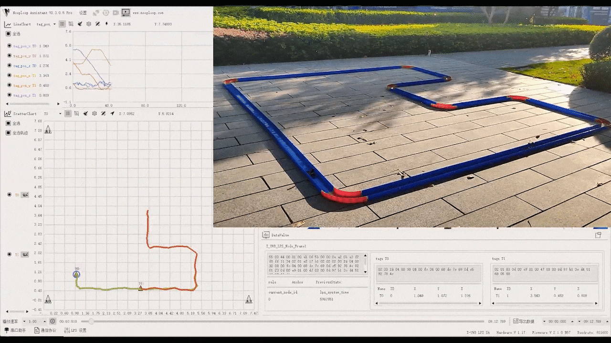

[简体中文](./README.md)  | English

<h1 align="center">NLink Parser ROS Package</h1>

This ROS package is used to support Nooploop products. It is written in C + +. According to the corresponding product manual, configure the device through Nassistant. After confirming that the device has been working normally, run the node corresponding to the product in the ROS package to obtain the one-to-one ROS message corresponding to the product protocol, saving you the time of data communication and parsing

  

Products Supported

- [LinkTrack](https://www.nooploop.com/) is a multi-functional system based on UWB technology, which integrates positioning, distributed ranging, time service and communication functions. The typical two-dimensional positioning accuracy is ± 10cm, the data update frequency is as high as 200Hz, the capacity of Anchor is up to 120, and the Tag capacity is up to 200. All nodes are wireless automatic networking, and the Anchor's coordinates can be calibrated by one key, which is convenient for deployment.

  

- [LinkTrack AOA](http://www.nooploop.com/linktrack-aoa) This is a high-precision tracking system based on UWB. The typical ranging accuracy is as high as ± 5cm, the typical direction finding accuracy is as high as ± 5 ° and the refresh frequency is as high as 200Hz. It integrates ranging, direction finding, time service and communication.

- [TOFSense](https://www.nooploop.com/tofsense) is a laser ranging sensor based on TOF (Time of Flight) technology. The ranging range is 1 cm ~ 5 m, the range resolution is 1 mm, the data update frequency is 10 Hz, the FOV is adjustable, the maximum field of view is 27 ° and multi-sensor cascade output is supported.

## Table of Contents

- [Table of Contents](#table-of-contents)
- [Getting Started](#getting-started)
  - [Prerequisites](#prerequisites)
  - [Building](#building)
  - [Unit Tests](#unit-tests)
- [Products Usage](#products-usage)
  - [LinkTrack](#linktrack)
  - [LinkTrack AOA](#linktrack-aoa)
  - [TOFSense](#tofsense)
- [How to Subscribe Our Topic](#how-to-subscribe-our-topic)
- [Submodule](#submodule)
  - [nlink_unpack](#nlink_unpack)
  - [protocol_extracter](#protocol_extracter)
- [License](#license)
- [Bugs & Feature Requests](#bugs--feature-requests)
- [FAQ](#faq)
  
## Getting Started

### Prerequisites

- [Robot Operating System (ROS)](http://wiki.ros.org) (middleware for robotics)
  
    Running this program requires ROS support. If it is not installed, please install ROS first.

- [Serial Library](https://github.com/nooploop-dev/serial.git)

    This program and hardware devices use serial communication, please click to install the serial library. Note that if it is the first time to use serial port device, you usually need to open the serial port operation authority. For details, please refer to [Fix serial port permission denied errors on Linux](https://websistent.com/fix-serial-port-permission-denied-errors-linux/)

### Building

Clone the code and compile it as follows

    cd catkin_workspace/src
    git clone --recursive https://github.com/nooploop-dev/nlink_parser.git 
    cd ../
    catkin_make
    source devel/setup.bash

Note that each time you open a new command-line window, you need to execute `source devel/setup.bash` to retrieve the ROS workspace environment variable

### Unit Tests

Run

    roscore
    catkin_make run_tests

## Products Usage

### LinkTrack

Run

    roslaunch nlink_parser linktrack.launch

Parameter
   - **`port_name`** Serial port name, default: `/dev/ttyUSB0`.
   - **`baud_rate`** Baud rate, default: `921600`.
  
Run msg converter if you need RVIZ support

    roslaunch nlink_parser linktrack_rviz.launch

Subscribed Topics

* **`/nlink_linktrack_data_transmission`** ([std_msgs::String])

	You can post a message on the topic to write the data to the linktrack node for  taking advantage of the data transmission function

Published Topics

  - **`/nlink_linktrack_anchorframe0`** ([nlink_parser::LinktrackAnchorframe0])
  - **`/nlink_linktrack_tagframe0`** ([nlink_parser::LinktrackTagframe0])
  - **`/nlink_linktrack_nodeframe0`** ([nlink_parser::LinktrackNodeframe0])
  - **`/nlink_linktrack_nodeframe1`** ([nlink_parser::LinktrackNodeframe1])
  - **`/nlink_linktrack_nodeframe2`** ([nlink_parser::LinktrackNodeframe2])
  - **`/nlink_linktrack_nodeframe3`** ([nlink_parser::LinktrackNodeframe3])
  - **`/nlink_linktrack_nodeframe5`** ([nlink_parser::LinktrackNodeframe5])
  - **`/nlink_linktrack_nodeframe6`** ([nlink_parser::LinktrackNodeframe6])

    If data is received from other nodes, then message will be released on `/nlink_linktrack_nodeframe0`
    
    Other topics are positioning data topics. When receiving the protocol frame data, messages will be automatically posted on the corresponding topics. The protocol type needs to be configured on Nassistant

### LinkTrack AOA

Run

    roslaunch nlink_parser linktrack_aoa.launch

Parameter
   - **`port_name`** Serial port name, default: `/dev/ttyUSB0`.
   - **`baud_rate`** Baud rate, default: `921600`.
  
Subscribed Topics

* **`/nlink_linktrack_data_transmission`** ([std_msgs::String])

	Same as LinkTrack

Published Topics

  - **`/nlink_linktrack_nodeframe0`** ([nlink_parser::LinktrackNodeframe0])
  - **`/nlink_linktrack_aoa_nodeframe0`** ([nlink_parser::LinktrackAoaNodeframe0])

### TOFSense

Run

    roslaunch nlink_parser tofsense.launch

Parameter
   - **`port_name`** Serial port name, default: `/dev/ttyUSB0`.
   - **`baud_rate`** Baud rate, default: `921600`.
   - **`inquire_mode`** For multi tofsense cascading, the program will automatically query and output multi node ranging results, default: `false`

Published Topics

  - **`/nlink_tofsense_cascade`** ([nlink_parser::TofsenseCascade]) 
  - **`/nlink_tofsense_frame0`** ([nlink_parser::TofsenseFrame0])

## How to Subscribe Our Topic

Refer to [nlink_example](https://github.com/nooploop-dev/nlink_example)，subscribe our topic in your ROS package

## Submodule

### [nlink_unpack](https://github.com/nooploop-dev/nlink_unpack)

It is used for products of Nooploop，like [LinkTrack](https://www.nooploop.com/)，[LinkTrack AOA](http://www.nooploop.com/linktrack-aoa)，[TOFSense](https://www.nooploop.com/tofsense.Written in pure C language, can be used for building protocol parsing code

### [protocol_extracter](https://github.com/nooploop-dev/protocol_extracter) 

It is a general data protocol extractor, which decouples protocol implementation and protocol extraction. Users only need to input data and process protocol callback function

## License

The source code is released under a [BSD 3-Clause license](LICENSE).

## Bugs & Feature Requests

Please report bugs and request features using the [Issue Tracker](https://github.com/nooploop-dev/nlink_parser/issues).

## FAQ
  - Run `rostopic echo...` to view the topic data, prompt "error: cannot load message class for... Are your messages built".
  
    If it has been compiled, please run `source {$ros_workspace}/devel/setup.bash` To add environment variables, where {$ros_workspace} represents the workspace directory where the current ROS package is located.

  - Running node, prompts "error while loading shared libraries: libserial.so : Cannot open shared object file: No such file or directory"
  
    If it is confirmed that the serial port library has been installed according to the previous link, the compilation is normal, and only the runtime prompts that the library file cannot be found, try
    1. Run `sudo gedit /etc/ld.so.conf.d/libc.conf`
    2. If there is no `/usr/local/lib`, add it
    3. Save the file and execute  `sudo ldconfig`
    4. Restart the computer